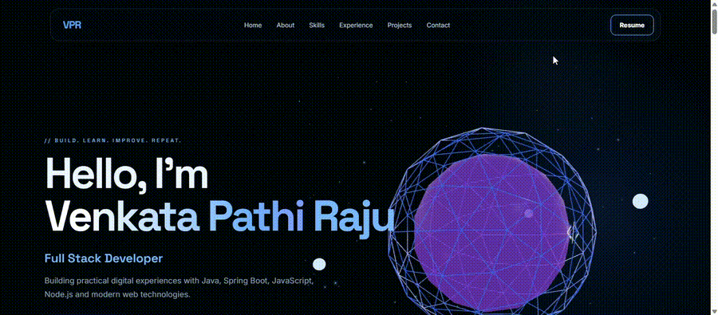
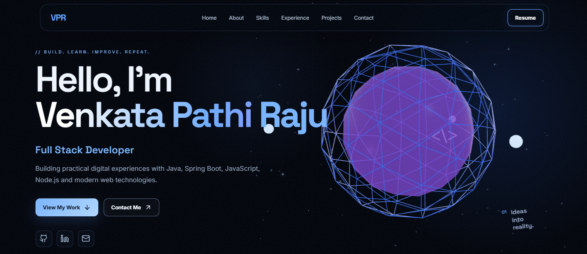
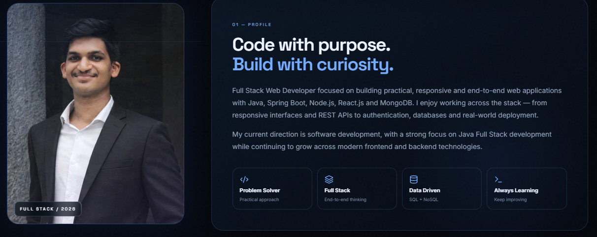
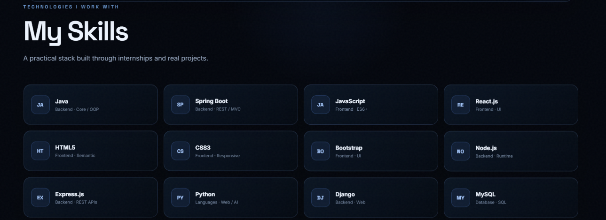
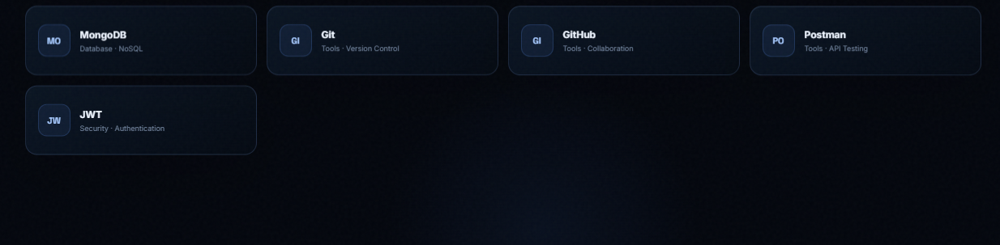
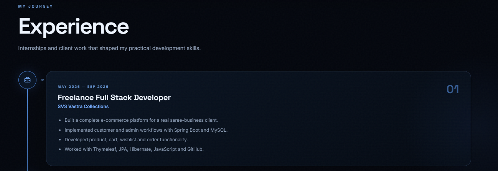

<div align="center">

# Venkata Pathi Raju — 3D Developer Portfolio

### Full Stack Developer • Java • Spring Boot • React • JavaScript

<p>
  <a href="https://venkatapathi-raju-fk7p.vercel.app/">
    
  </a>
  <a href="https://github.com/cvenkatapathi/VenkatapathiRaju-portfolio">
    
  </a>
</p>

<p>
  
  
  
  
  
</p>

</div>

---

## ✨ Portfolio Preview

<p align="center">
  
</p>

> An interactive developer portfolio designed around a dark cinematic interface, subtle motion, 3D visuals and a clean project-focused experience.

---

## 🚀 Overview

This repository contains my personal **3D developer portfolio**, built to present my technical skills, professional experience, academic background, certifications and selected projects in one interactive web experience.

The portfolio combines a modern React frontend with **Three.js-powered 3D visuals**, responsive layouts and lightweight animations to create a polished developer-focused interface.

### 🌐 Live Website

**[🚀 Visit My Portfolio](https://venkatapathi-raju-portfolio-fk7p.vercel.app/)**

---

## 🎯 What the Portfolio Showcases

- 👋 Personal introduction and developer profile
- 🧰 Technical skills and technologies
- 💼 Professional experience and internships
- 🎓 Education and certifications
- 🚀 Featured projects
- 🛠️ Development capabilities and services
- 💻 GitHub/open-source section
- 📩 Contact section
- 📄 Resume access
- 📱 Responsive experience across screen sizes

---

## 🎨 Design & Experience

The portfolio follows a **dark, cinematic developer aesthetic** with a blue/purple visual language.

### Visual highlights

- Interactive 3D hero scene
- Animated wireframe sphere
- Star-field background
- Glass-style content cards
- Soft borders and ambient lighting
- Scroll-based section presentation
- Responsive navigation
- Project cards with technology tags
- Consistent developer-oriented visual hierarchy
- Smooth micro-interactions and hover states

The goal was to keep the interface visually impressive without sacrificing readability or usability.

---

## 🧩 Main Sections

| Section | Purpose |
|---|---|
| **Home** | Introduction, role, 3D hero and primary actions |
| **About** | Developer profile and working approach |
| **Skills** | Technologies and tools I work with |
| **Experience** | Internships and freelance development work |
| **Education** | Academic background and certifications |
| **Projects** | Selected projects and their technology stacks |
| **What I Do** | Full-stack, e-commerce, REST API and AI capabilities |
| **GitHub** | Open-source work and repository access |
| **Contact** | Email, LinkedIn, GitHub and contact form |
| **Footer** | Social links and quick navigation |

---

## 🚀 Featured Projects

### 01 — SVS Vastra Collections

A full-stack e-commerce platform developed for a real-world saree business.

**Highlights**
- Customer shopping flow
- Product browsing
- Cart and wishlist functionality
- Order workflow
- Admin management
- REST/API and database integration

**Technologies:** Java, Spring Boot, MySQL, Thymeleaf, JavaScript

---

### 02 — ShopEase

A full-stack e-commerce application focused on authentication, product browsing and shopping workflows.

**Highlights**
- Authentication
- Product browsing
- Cart and checkout flow
- Admin management

**Technologies:** Node.js, Express.js, MongoDB, EJS, Bootstrap

---

### 03 — AI Interviewer

An AI-based interview automation application combining a Django backend with NLP and machine-learning based response analysis.

**Technologies:** Python, Django, NLP, Machine Learning, SQLite

---

## 🛠️ Technology Stack

### Frontend

- React.js
- JavaScript (ES6+)
- HTML5
- CSS3
- Bootstrap

### Backend

- Java
- Spring Boot
- Node.js
- Express.js
- Django

### Database

- MySQL
- MongoDB
- SQLite

### Tools & Development

- Git
- GitHub
- Postman
- VS Code
- IntelliJ IDEA
- Vite
- Three.js
- GSAP

---

## 📁 Project Structure

```text
raju-3d-portfolio/
│
├── public/
│   ├── profile.jpg
│   └── resume.pdf
│
├── src/
│   ├── components/
│   │   ├── Nav.jsx
│   │   ├── Scene.jsx
│   │   └── SectionTitle.jsx
│   │
│   ├── data/
│   │   └── portfolio.js
│   │
│   ├── App.jsx
│   ├── main.jsx
│   └── styles.css
│
├── index.html
├── package.json
├── package-lock.json
└── README.md
```

---

## 💻 Run Locally

### 1. Clone the repository

```bash
git clone https://github.com/cvenkatapathi/VenkatapathiRaju-portfolio.git
```

### 2. Enter the project directory

```bash
cd VenkatapathiRaju-portfolio/raju-3d-portfolio
```

### 3. Install dependencies

```bash
npm install --legacy-peer-deps
```

### 4. Start the development server

```bash
npm run dev
```

The application will be available on the local Vite development URL shown in the terminal.

---

## 📦 Production Build

Create a production build with:

```bash
npm run build
```

Preview the production build locally with:

```bash
npm run preview
```

---

## ☁️ Deployment

The portfolio is deployed on **Vercel**.

### Production URL

**[https://venkatapathi-raju-fk7p.vercel.app/](https://venkatapathi-raju-portfolio-fk7p.vercel.app/)**

The project is connected to GitHub so future changes can follow the normal workflow:

```text
Local Changes
     ↓
git add .
     ↓
git commit
     ↓
git push
     ↓
GitHub
     ↓
Vercel Deployment
     ↓
Live Portfolio
```

---

## 📸 Portfolio Screenshots

### Home — 3D Hero

<p align="center">
  
</p>


### About Me

<p align="center">
  
</p>

### Skills -->

<p align="center">
  
</p>

### Skills

<p align="center">
  
</p>

### Expericence

<p align="center">
  
</p>

---

## 📌 Repository

**GitHub:**  
https://github.com/cvenkatapathi/VenkatapathiRaju-portfolio

**Live Portfolio:**  
[https://venkatapathi-raju-fk7p.vercel.app/](https://venkatapathi-raju-portfolio-fk7p.vercel.app/)

---

## 👨‍💻 Author

### Venkata Pathi Raju

Full Stack Developer focused on building practical, responsive and end-to-end web applications.

**GitHub:** [@cvenkatapathi](https://github.com/cvenkatapathi)

**Portfolio:** [Visit Website](https://venkatapathi-raju-portfolio-fk7p.vercel.app/)

---

<div align="center">

### Build. Learn. Improve. Repeat.

⭐ If you find the project interesting, feel free to explore the repository.

</div>
